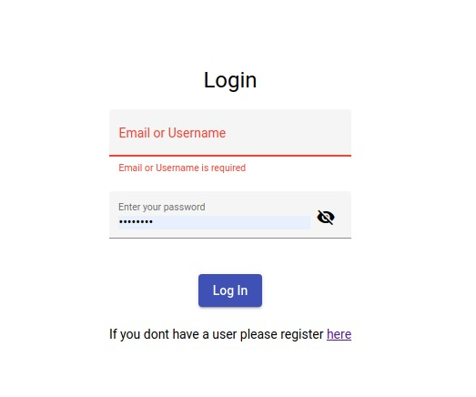

# Tehcnologies stack seed

This poject is intended for those developers that want to start a project from scratch and doesnt devide about the stack techonolgies.

Basically the project contains modules for authentication, atuhorization, register and login users user cases.



The main idea of this project is that you can the technologies that best fit for you and have a starter project without dealing with a lot of staff.

For example you can pick a stack with angular9 + kiwi-server + mongodb or you can pick another stack with react + .net core + postgress.

# Table of Contents
* [Flavors](#flavors)
* [Front End Flavors](#fron-end-flavors)
  * [Angular 9](#angular9)
  * [PWA](#pwa) 
  * [React](#react) (TODO)
* [Mobile Flavors](#mobile-flavors) (TODO)
  * [React Native](#react) TODO)
  * [Xamarin](#xamarin) (TODO)
* [Rest Api Flavors](#rest-api-flavors)
  * [Kiwi Server](#kiwi-server)
  * [.Net Core](#.net-core) (IN PROGRESS)
* [Future Work](#Future-work)

## Flavors
On each layer we define some flavors to identify the tehcnologie that you want to use it.

We decide to use JWT to manage authentication so each layer is going to use the same.

Not all the flavors has an impelementatios but we are working to have.


### Fron end flavors
At the moment we only have an application developed using angular 9 and also the same application is a PWA.

In the  future we hope to add a React application.

### Angular9
We create an angular 9 application using the angular cli

Application use cases
* Login
* Register 
* Forgot Password
* Small admin page where you see the list of users

For more information about this project please follow this [link](uis/angular9)

### PWA
In our case we adde pwa capabilities inside the angular9 applications.

If you need to read about please take a look at this [post](http://blog.cavepot.com/angular-9-pwa/)

#### External Packages
* ng-block-ui (https://www.npmjs.com/package/ng-block-ui)
* ngx-toastr (https://www.npmjs.com/package/ngx-toastr)
* We are using css flex (https://css-tricks.com/snippets/css/a-guide-to-flexbox/)
* Angular Reactive Forms (https://angular.io/guide/reactive-forms)
  * Default validators
  * Custom validators
* Authentication with guards and interceptors
  
  *  https://medium.com/@ryanchenkie_40935/angular-authentication-using-route-guards-bf7a4ca13ae3
  
  * https://angular.io/api/common/http/HttpInterceptor

## Rest Api Flavors
All apis has the folloging services
* POST `/user` (register a new user) [username, mail, password]
* GET `/user/curren` (get the current user)
* POST `/user/login` (authenticate a user) [username, password]
* POST `/user/forgot-password` [mail]
* POST `/user/reset-passowrd` [token, password] 

### Responses
```json
{
  "result": number,
  "msg": string,
  "data": any
}
```

#### Sample register ok
```json
{
  "result": 0,
  "msg": "User registered successfuly",
  "data": null
}
```

#### Sample register error
```json
{
  "result": 1,
  "msg": "Username or mail already taken",
  "data": null
}
```

### Kiwi Server
We create a rest api with the following services using kiwi-server.

For more information about this project please follow this [link](https://ollita7.github.io/viking-seed/apis/kiwi-server)


### .Net Core
IN PROGRESS

For more information about this project please follow this [link](https://ollita7.github.io/viking-seed/apis/.dotnetcore)

## Future Work
1. Create reale case (API for register, reset password, list users) (GUILLE)
2. ADD JWT
3. Documentation about angular material
4. Add documentation (UI y API)
5. Integrate PWA (https://angular.io/guide/service-worker-getting-started)
