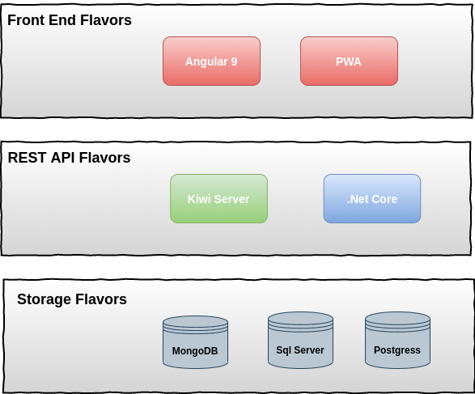

# Tehcnologies stack seed

This poject is intended for those developers that want to start a project from scratch and doesnt devide about the stack techonolgies.

Basically the contains modules for authentication, atuhorization, register and login users.

Selecting the right stack you can have an application to start without dealing with a lot of staff.

# Table of Contents
* [Flavors](#flavors)
* [Front End Flavors](#fron-end-flavors)
  * [Angular 9](#angular9)
* [Rest Api Flavors](#rest-api-flavors)
  * [Kiwi Server](#kiwi-server)
  * [.Net Core](#.net-core)
* [Future Work](#Future-work)

## Flavors
On each layer we define some flavors to identify the tehcnologie that you want to use it.
Not all the flavors has an impelementatios but we are working to have.

### Fron end flavors
At the moment we only have an application developed using angular 9 and also the same apllication is a PWA.

In the  future we hope to add a React application.

### Angular9
We create an angular 9 application using the angular cli

#### External Packages
* ng-block-ui (https://www.npmjs.com/package/ng-block-ui)
* ngx-toastr (https://www.npmjs.com/package/ngx-toastr)
* We are using css flex (https://css-tricks.com/snippets/css/a-guide-to-flexbox/)
* Angular Reactive Forms (https://angular.io/guide/reactive-forms)
  * Default validators
  * Custom validators
* Authentication with guards and interceptors
  
  *  https://medium.com/@ryanchenkie_40935/angular-authentication-using-route-guards-bf7a4ca13ae3
  
  * https://angular.io/api/common/http/HttpInterceptor

## Rest Api Flavors
We create a rest api

## Kiwi Server
We create a rest api using Kiwi Server

## .Net Core
IN PROGRESS

## Future Work
1. Create reale case (API for register, reset password, list users) (GUILLE)
2. ADD JWT
3. Documentation about angular material
4. Add documentation (UI y API)
5. Integrate PWA (https://angular.io/guide/service-worker-getting-started)
